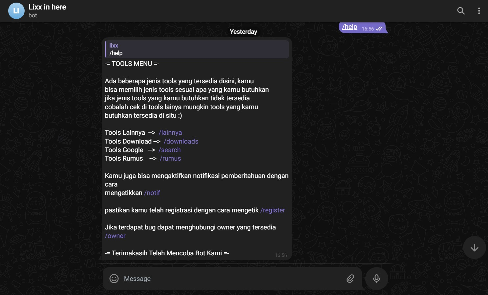
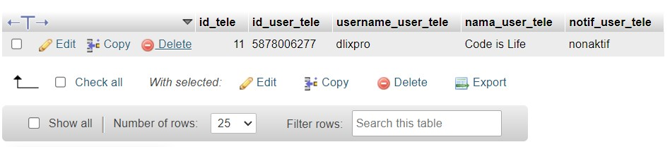

<p align="center">
    <br>
    
</p>

# Bot Telegram menggunakan Database dan mempunyai beberapa Fitur
> pertama saya ucapkan terima kasih kepada kalian yang mau mampir, fyi ini github pertama saya di tahun ini setelah sekian lama tidak upload project gabut atau code terbaru kali ini saya mau membagikan contoh bot telegram yang terhubung dengan fitur database 


## Setting dan cara penggunaan Bot Telegram
sebelumnya kamu harus sudah terinstall python di device kamu, kemudian ambil project dari github saya

1. [Fork](https://github.com/AdliXSec/TeleBotWithDatabase) the project

```sh
# Clone
git clone https://github.com/AdliXSec/TeleBotWithDatabase
cd TeleBotWithDatabase
```
2. Install semua library dengan cara

```sh
# Install
pip install -r requirements.txt
```
3. Sebelum di jalankan pergi ke folder config lalu buka confff.py yang berisi

```python
# configurasi
# Acc Instagram untuk download postingan instagram (opsional)
ig_log = "username_ig"
ig_pw  = "password_ig"

# Acc Telegram (wajib)
id = 123456789 #ID telegram kamu
username_owner = "username" #Username telegram kamu

api = "YOUR_CODE_TELEGRAM_API" #di peroleh dari botfather
```

4. Setelah semua library dan file confff.py sudah di ganti, saatnya run code dengan cara :
```sh
python main.py
```
>Sekian dari saya tanpa banyak basa basi lagi sekian dan terima kasih. Jika  Terdapat error silahkan hubungi sosial media saya yang tercantum